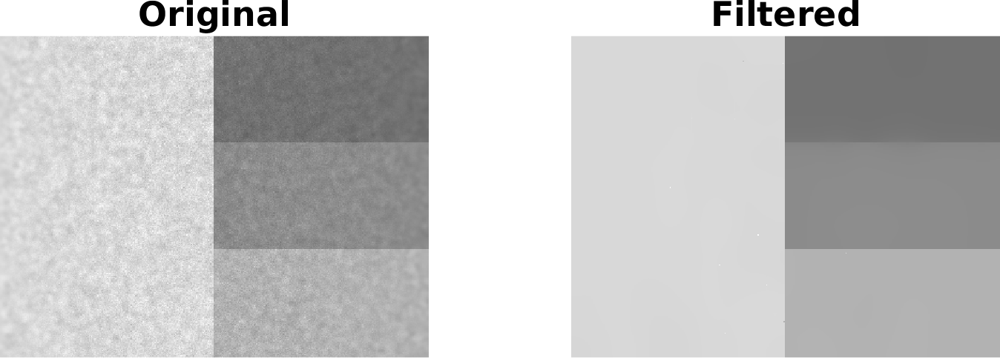

# Fast Global Smoothing Based on Weighted Least-Squares

Reimplementation of the paper "D. Min, S. Choi, J. Lu, B. Ham, K. Sohn, and M. N. Do, Fast Global Image Smoothing Based on Weighted Least Squares, *IEEE Trans. on Image Processing*, 23(12), 5638-5653, 2014"

## Usage

Two demo codes in MATLAB and C++ are provided.

### MATLAB API

- output_image = FastGlobalSmoothing(input_image, sigma, lambda)
- output_image = FastGlobalSmoothing(input_image, sigma, lambda, solver_iteration)
  

**Platform**       **Binary MEX File Extension**
Linux (64-bit)     .mexa64
Windows (64-bit)   .mexw64

### C++ API

int FastGlobalSmoothing(float* image, int width, int height, float sigma, float lambda, int solver_iteration = 3)

The elements of **single channel** data *image* are arranged in **row-major** order.

The output image buffer **overwrites** the input image buffer.

## License

Copyright (c) 2020, Li Chen All rights reserved.

For research and education purpose only.
